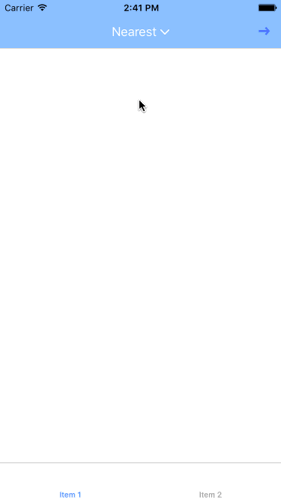
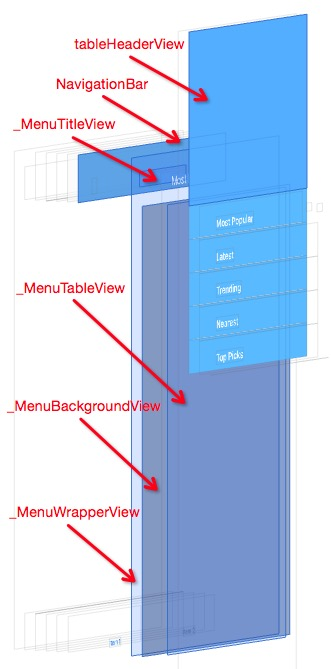

# DropdownMenu



## 介绍

模仿自 [BTNavigationDropdownMenu](https://github.com/PhamBaTho/BTNavigationDropdownMenu)，只是用于学习，使用了 iOS 9 的布局 API，不兼容低版本。

另外这篇博客 [使用Masonry创建一个下拉式菜单（全）](http://www.jianshu.com/p/1d9feb588899) 比较详细地介绍了具体思路，并且是用 OC 写的。 

使用方式如下：

```swift
let dropdownMenu = DropdownMenu.dropdownMenu()

dropdownMenu.items = ["Most Popular", "Latest", "Trending", "Nearest", "Top Picks"]
dropdownMenu.selectedItem = 3
dropdownMenu.didSelectItemAtIndexHandler = {
    print("selectedItem: \($0), index: \($1)")
}

dropdownMenu.menuWidth = 300
dropdownMenu.menuTextFont = UIFont.boldSystemFontOfSize(15)
dropdownMenu.menuTextColor = UIColor.whiteColor()
dropdownMenu.menuTitleColor = UIColor.whiteColor()
dropdownMenu.separatorColor = UIColor(red: 0.78, green: 0.78, blue: 0.8, alpha: 1.0)
dropdownMenu.menuCheckmarkColor = UIColor.whiteColor()
dropdownMenu.menuBackgroundColor = navigationController!.navigationBar.barTintColor

navigationItem.titleView = dropdownMenu
```

## 思路

### 层级关系处理



如上图所示，`dropdownMenu`其实只是导航栏上的`titleView`那一小块。

`_MenuWrapperView`是添加到窗口上的，和窗口等大小。

`_MenuBackgroundView`和`_MenuTableView`被添加到`_MenuWrapperView`上，顶部紧贴导航栏底部。

关于菜单视图的添加与移除，有两点需要明确：

1. 在`dropdownMenu`被设置为`navigationItem.titleView`后，它会被添加到导航栏上，`navigationBar`即是它的父视图。如果导航控制器`push`或者`pop`到其他控制器，由于导航栏是公用的，`dropdownMenu`会从导航栏移除，自然也会从窗口移除。

2. 如果使用了`UITabBarController`，切换标签页后，整个导航控制器视图层级都会从窗口移除，但是`dropdownMenu`不会从导航栏移除。

结合以上两点，可以看出`DropdownMenu`的`didMoveToWindow()`方法非常适合处理菜单视图的添加和移除操作：

```swift
override func didMoveToWindow() {
    if let window = window {
    	// 一些其他设置
    	menuTitleView.titleColor = menuTitleColor
        menuTableView.contentInset.top = menuTableViewContentInsetTop
        menuTableView.tableHeaderView?.backgroundColor = menuBackgroundColor
        // 添加菜单视图到窗口，并设置约束
        window.addSubview(menuWrapperView)
        setupMenuViewConstraintsIfNeedWithNavigationBar(superview!)
        NSLayoutConstraint.activateConstraints(menuViewConstraints)
    } else {
        menuWrapperView.removeFromSuperview()
    }
}
```

### 动画效果处理

动画效果代码如下：

```swift
func performAnimation() {
    isAnimating = true // 标记动画过程开始
    if isOpen { menuWrapperView.hidden = false } // 菜单打开则显示 _MenuWrapperView
    UIView.animateWithDuration(1.0,
        delay: 0,
        usingSpringWithDamping: 0.7,
        initialSpringVelocity: 0,
        options: [],
        animations: {
            self.menuBackgroundView.alpha = self.backgroundViewAlpha
            self.menuTableView.contentInset.top = self.menuTableViewContentInsetTop
            self.menuTitleView.arrowImageView.transform = self.arrowImageViewTransform
        }, completion: { _ in
            self.isAnimating = false // 标记动画过程结束
            if !self.isOpen { self.menuWrapperView.hidden = true } // 菜单关闭则隐藏 _MenuWrapperView
    })
}
```

上述代码在动画块中根据菜单打开还是关闭调整了蒙版`_MenuBackgroundView`的`alpha`，导航栏`titleView`上的`_MenuTitleView`右侧的小箭头的方向，以及`_MenuTableView`的`contentInset.top`。

之前是通过调整`_MenuTableView`的约束使之整体上下移动，但是效果不太好，改为调整`contentInset.top`后就好多了，约束也无需改动了。

`menuTableViewContentInsetTop`计算方式如下：

```swift
var menuTableViewContentInsetTop: CGFloat {
    let tableHeaderViewHeight = menuTableView.tableHeaderViewHeight
    return isOpen ?
        -tableHeaderViewHeight :
        -(menuTableView.rowHeight * CGFloat(itemCount) + tableHeaderViewHeight)
}
```

为了防止`_MenuTableView`向下拖动时露出背后的背景，为其添加了一个足够高的`tableHeaderView`，并将其背景色设置为菜单的背景色。

菜单打开时，令`contentInset.top`为`-tableHeaderViewHeight`，即`tableHeaderView`的高度，这样`tableHeaderView`就在可见区域上方了。

菜单关闭时，将`contentInset.top`再加上所有行的行高之和，这样`_MenuTableView`的所有单元格也都会跑到可见区域上方了。

### 触摸事件处理

菜单打开时，导航栏上除了`DropdownMenu`，其他部分都不响应触摸，`_MenuTableView`可正常拖动，点击周围的蒙版区域即`_MenuBackgroundView`则会关闭菜单。

`_MenuWrapperView`是`_MenuBackgroundView`和`_MenuTableView`的父视图，非常方便控制触摸事件的响应者。

因此在`_MenuWrapperView`中，实现了下面这个方法来决定触摸事件的响应者：

```swift
override func hitTest(point: CGPoint, withEvent event: UIEvent?) -> UIView? {
    // 隐藏即菜单处于关闭状态，自身及其子视图放弃处理此次事件，窗口上位于 _MenuWrapperView 下层的视图层级有机会处理事件
    guard !hidden else {
        return nil
    }

    // 点击点位于 DropdownMenu 上，让其处理此次点击事件
    if dropdownMenu.bounds.contains(dropdownMenu.convertPoint(point, fromView: self)) {
        return dropdownMenu
    }

    // 点击不在 DropdownMenu 上，但是在导航栏上（包括状态栏），不做处理，单纯拦截掉此次事件
    if point.y < menuTableView.frame.minY {
        return self
    }

    // 点击点位于 _MenuTableView 的内容范围内，让其处理此次事件
    let contentX      = menuTableView.frame.minX
    let contentY      = menuTableView.frame.minY
    let contentWidth  = menuTableView.bounds.width
    let contentHeight = menuTableView.contentSize.height - menuTableView.tableHeaderViewHeight
    let contentFrame  = CGRect(x: contentX, y: contentY, width: contentWidth, height: contentHeight)
    if contentFrame.contains(point) { return menuTableView }

    // 点击点位于 _MenuTableView 的内容范围外的 _MenuBackgroundView 区域，让 DropdownMenu 处理，即关闭菜单
    return dropdownMenu
}
```

### 单元格的处理

由于最后一行的单元格有分隔线不好看，因此隐藏了分隔线，自己单独绘制。

```swift
override func drawRect(rect: CGRect) {
    guard !hiddenSeparator else { return }

    let lineWidth = 1 / traitCollection.displayScale
    let y = round(rect.height) - lineWidth / 2.0 // 偏移 0.5 个像素对应的点，防止出现像素模糊

    let context = UIGraphicsGetCurrentContext()
    CGContextMoveToPoint(context, 10, y)
    CGContextAddLineToPoint(context, rect.width - 10, y)
    CGContextSetLineWidth(context, lineWidth)
    CGContextSetStrokeColorWithColor(context, separatorColor?.CGColor)
    CGContextStrokePath(context)
}
```

另外发现使用`Default`风格的单元格时，`textLabel`很大，直接盖住了分隔线，因此需要使用其他风格。

右侧的小箭头使用辅助视图即可：

```swift
override func setSelected(selected: Bool, animated: Bool) {
    accessoryType = selected ? .Checkmark : .None
}
```
