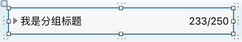
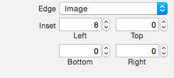
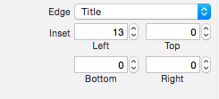
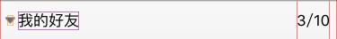

# QQFriendListDemo

仿 QQ 好友下拉列表...


思路是子类化`UITableViewHeaderFooterView`,提供自定义的`headerView`.

使用一个等大的按钮作为其子控件,并设置相应图片即可.最右侧则是一个`UILabel`.如图所示:



设置按钮的内容左对齐,并适当调整`image`和`title`的内切距离.





为了在`headerView`被点击时能得到通知,定义了一个代理方法:

```objective-c
- (void)headerViewDidTapped:(LXHeaderView *)headerView;
```

使用模型`LXGroupModel`的`section`和`open`属性来记录不同分组的展开状态:

```objective-c
// 模型类 LXGroupModel
@property (nonatomic, readonly, strong) NSNumber *section;
@property (nonatomic, assign, getter=isOpen) BOOL open;
```

在`UITableView`的代理方法中,提供自定义的`headerView`,设置代理,并绑定对应的`LXGroupModel`分组模型:

```objective-c
- (UIView *)tableView:(UITableView *)tableView viewForHeaderInSection:(NSInteger)section
{
    LXHeaderView *headerView = [tableView dequeueReusableHeaderFooterViewWithIdentifier:kLXHeaderViewIdentifier];

    headerView.delegate = self;
    
    [headerView configureWithGroupModel:self.groupModels[section]];

    return headerView;
}

- (CGFloat)tableView:(UITableView *)tableView heightForHeaderInSection:(NSInteger)section
{
    return kLXHeaderViewHeight;
}
```

`headerView`被点击时,对`button`的`imageView`做一个旋转动画,并通知代理:

```objective-c
[UIView animateWithDuration:0.25 animations:^{
    _button.imageView.transform = CGAffineTransformMakeRotation(_groupModel.isOpen ? M_PI_2 : 0);
}];

if ([_delegate respondsToSelector:@selector(headerViewDidTapped:)]) {
    [_delegate headerViewDidTapped:self];
}
```

这里有个问题就是`button`的`imageView`旋转后,小三角图片两侧会超出范围.如图:



因此还需要对`button`进行如下设置:

```objective-c
// 防止旋转后超出范围的图片被裁剪掉.
_button.imageView.clipsToBounds = NO;
// 防止旋转后图片变形.
_button.imageView.contentMode = UIViewContentModeCenter;
```

代理收到`headerView`被点击的回调后,就可以让`tableView`刷新该组:

```objective-c
[self.tableView reloadSections:[NSIndexSet indexSetWithIndex:headerView.groupModel.section.integerValue]
              withRowAnimation:UITableViewRowAnimationAutomatic];
```

最后还有个细节就是快速点击`headerView`时按钮不会呈现高亮状态,这个可以通过关闭`UIScrollView`的`delaysContentTouches`解决:


但是这样也会导致触摸点在`headerView`上也就是`UIButton`上时无法滚动`tableView`,所以还需要继承`UITableView`,重写下面这个方法:

```objective-c
- (BOOL)touchesShouldCancelInContentView:(UIView *)view
{
    // 若 view 为 UIControll, 则此方法的默认实现会返回 NO.
    // 这将导致在 headerView 上滑动时, tableView 会转发消息给 button 而自己无法滑动.
    return YES;
}
```
