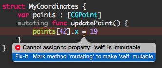

# What’s New in Swift 2.0

学习自 [WWDC 2015 Session 106 What’s New in Swift](https://developer.apple.com/videos/play/wwdc2015-106/) 的 PPT。

- [基础改进](#Fundamentals)
- [模式匹配](#Pattern Matching)    
- [API 可用性检查](#API Availability Checking)
- [协议扩展](#Protocol Extensions)
- [错误处理](#Error Handling)

<a name="Fundamentals"></a>
## 基础改进

### 枚举

#### 打印输出增强

```swift
enum Animals {
    case Dog, Cat, Troll, Dragon
}
let a = Animals.Dragon
print(a) // Swift 1.x，打印 (Enum Value)；Swift 2.x，打印 Dragon
```

#### 泛型关联值改进

Swift 2.0 之前，下面这个泛型关联值的枚举会由于无法确定关联值所占内存大小而编译报错：

`error: unimplemented ir generation feature non-fixed multi-payload enum layout`

```swift
enum Either<T1, T2> {
    case First(T1)
    case Second(T2)
}
```

Swift 2.0 解决了上述问题。

#### 递归枚举支持

在 Swift 2.0 之前，像下面这样使用枚举类型本身作为关联值类型将无法通过编译：

```swift
enum Tree<T> {
    case Leaf(T)
    case Node(Tree, Tree)
}
```

Swift 2.0 开始支持递归枚举，只需标注`indirect`关键字即可：

```swift
enum Tree<T> {
    case Leaf(T)
    indirect case Node(Tree, Tree)
}
```

### do 语句

Swift 2.0 引入了一种`do`语句，可以使用该语句创建一个局部作用域，而在此之前只能使用闭包来实现此需求。

```swift
do {
    let 😂 = "笑哭"
}
print(😂) // 超出了作用域 error: use of unresolved identifier '😂'
```

由于`do`语句的引入，为了和`do-while`语句更好地区分开来（否则就需要跑到花括号底部去查看是否还有一个`while`关键字），后者更名为`repeat-while`了：

```swift
var count = 0
repeat {
    print("😂")
} while ++count < 3
```

### 选项集合

#### 操作选项集合

Swift 2.0 之前，类似下面这样操作选项集合：

```swift
// 创建多个选项的选项集合
viewAnimationOptions = .Repeat | .CurveEaseIn | .TransitionCurlUp 
// 创建空选项集合
viewAnimationOptions = nil 
// 判断选项集合是否包含某选项
if viewAnimationOptions & .TransitionCurlUp != nil {
    // 包含 TransitionCurlUp 选项
}
```

Swift 2.0 开始，应该类似下面这样操作选项集合：

```swift
// 创建多个选项的选项集合
viewAnimationOptions = [.Repeat, .CurveEaseIn, .TransitionCurlUp]
// 创建空选项集合
viewAnimationOptions = []
// 判断选项集合是否包含某选项
if viewAnimationOptions.contains(.TransitionCurlUp) {
    // 包含 TransitionCurlUp 选项
}
```

#### 定义选项集合

Swift 2.0 开始，类似下面这样定义选项集合：

```swift
struct MyFontStyle : OptionSetType {
    let rawValue: Int
    static let Bold = MyFontStyle(rawValue: 1)
    static let Italic = MyFontStyle(rawValue: 2)
    static let Underline = MyFontStyle(rawValue: 4)
    static let Strikethrough = MyFontStyle(rawValue: 8)
}

struct MyFont {
    var style: MyFontStyle
}

// 用空选项集合初始化 MyFont 实例
var myFont = MyFont(style: [])
// 修改 style 属性的值为具有单一选项的选项集合
myFont.style = [.Underline]
// 修改 style 属性的值为具有多个选项的选项集合
myFont.style = [.Bold, .Italic]
// 判断 style 属性的选项集合是否包含某选项
if myFont.style.contains(.Strikethrough) {
    // 包含 Strikethrough 选项
}
```

### 函数和方法

#### 统一参数标签

如下代码定义了一个函数和一个类中的实例方法：

```swift
func save(name: String, encrypt: Bool) { /* ... */ }

class Widget {
    func save(name: String, encrypt: Bool) { /* ... */ }
}
```

Swift 2.0 之前，默认情况下，调用函数时不需要提供外部参数名，调用方法时，从第二个参数开始，需要提供外部参数名，即遵循 Objective-C 中的调用约定：

```swift
save("thing", false)
Widget().save("thing", encrypt: false)
```

Swift 2.0 开始，函数将沿用方法的调用约定，即默认情况下，从第二个参数开始，需要提供外部参数名：

```swift
save("thing", encrypt: false)
Widget().save("thing", encrypt: false)
```

注意这种改变不适用于导入到 Swift 的 C 和 Objective-C 的 API，例如：

```swift
UIGraphicsBeginImageContextWithOptions(CGSize(), true, 0)
```

#### 控制参数标签

Swift 2.0 开始，移除了先前用于修饰参数名称的`#`，如果想为第一个参数提供外部参数名，需要显示提供：

```swift
func save(name name: String, encrypt2 encrypt: Bool) { /* ... */ }

class Widget {
    func save(name name: String, encrypt2 encrypt: Bool) { /* ... */ }
}
```

上述代码为函数和方法的首个参数添加了外部参数名，并改变了第二个参数的默认参数名，因此调用时需提供对应的外部参数名：

```swift
save(name: "thing", encrypt2: false)
Widget().save(name: "thing", encrypt2: false)
```

当然，依然可以使用下划线`_`省略外部参数名：

```swift
func save(name: String, _ encrypt: Bool) { /* ... */ }

class Widget {
    func save(name: String, _ encrypt: Bool) { /* ... */ }
}
```

```swift
save("thing", false)
Widget().save("thing", false)
```

### 编译器诊断

思考下面的代码：

```swift
struct MyCoordinates {
    var points : [CGPoint]
    func updatePoint() {
        points[42].x = 19
    }
}
```

Swift 2.0 之前，编译器只会提示这么个玩意：

`'@lvalue $T7' is not identical to 'CGFloat'`

`Cannot assign to the result of this expression`

Swift 2.0 开始，编译器会智能提示出问题所在并给出贴心的修复方案：



另外，编译器现在会智能提示将没有做任何修改的变量声明为`let`。

### SDK 改进

由于轻量泛型的引入，Objective-C 和 C 的 API 导入到 Swift 后，其类型将更为明确：

```swift
// 之前的 API 一般类似这样，充斥着各种 AnyObject 和可选类型
class func requestHeaderFieldsWithCookies(cookies: [AnyObject]!) -> [NSObject : AnyObject]!
```

```swift
// 引入轻量泛型后，参数和返回值的类型和为空性都十分明确了
class func requestHeaderFieldsWithCookies(cookies: [NSHTTPCookie]) -> [String : String]
```

在自己的 Objective-C 代码中，应该遵循下面的良好实践，这样过渡到 Swift 会更为容易：

- 使用为空性标注
- 使用轻量泛型明确集合中元素的类型
- 使用`NS_ENUM`、`NS_OPTIONS`、`instancetype`、`@property`等更现代化的 Objective-C 语言特性

### 单元测试与访问控制

Swift 2.0 开始，public 和 internal 访问级别均可被单元测试 target 访问。

<a name="Pattern Matching"></a>
## 模式匹配

### if let

Swift 1.2 之前，大量`if let`语句看起来就像厄运金字塔一样：

```swift
func prepareForSegue(segue: UIStoryboardSegue, sender: AnyObject?) {
    if let dest = segue.destinationViewController as? BlogViewController {
        if let blogIndex = tableView.indexPathForSelectedRow()?.row {
            if segue.identifier == blogSegueIdentifier {
                // ...
            }
        }
    }
}
```

Swift 1.2 开始，`if let`语句可包含多个`let`，每个`let`都可搭配一个`where`：

```swift
func prepareForSegue(segue: UIStoryboardSegue, sender: AnyObject?) {
    if let dest = segue.destinationViewController as? BlogViewController,
       let blogIndex = tableView.indexPathForSelectedRow()?.row
        where segue.identifier == blogSegueIdentifier {
        // ...
    }
}
```

### guard

Swift 2.0 之前，需使用`if`语句进行条件检查，在条件不满足时提前退出：

```swift
func process(json: AnyObject) -> Either<Person, String> {
    let name: String! = json["name"] as? String
    if name == nil {
        return .Second("missing name")
    }
    let year: Int! = json["year"] as? Int
    if year == nil {
        return .Second("missing year")
    }
    let person = processPerson(name, year)
    return .First(person)
}
```

Swift 2.0 开始，可以使用新引入的`guard`语句实现提前退出，而且可选类型使用`guard`解包后，在之后都可以使用：

```swift
func process(json: AnyObject) -> Either<Person, String> {
    guard let name = json["name"] as? String else {
        return .Second("missing name")
    }
    guard let year = json["year"] as? Int else {
        return .Second("missing year")
    }
    let person = processPerson(name, year)
    return .First(person)
}
```

`guard`语句也支持多个条件复合：

```swift
func process(json: AnyObject) -> Either<Person, String> {
    guard let name = json["name"] as? String,
          let year = json["year"] as? Int else {
        return .Second("bad input")
    }
    let person = processPerson(name, year)
    return .First(person)
}
```

### if case

Swift 1.0 开始，就支持如下这样使用`switch`语句匹配枚举值：

```swift
switch bar() {
case .MyEnumCase(let value) where value != 42:
    // ...
default: break
}
```

Swift 2.0 开始，新引入了`if case`语句，匹配单个枚举值时十分方便：

```swift
if case .MyEnumCase(let value) = bar() where value != 42 {
    // ...
}
```

### for in

Swift 2.0 之前，使用`for in`循环遍历集合时，若想进行条件判断，需要下面这样：

```swift
for value in mySequence {
    if value != "" {
        // ...
    }
}
```

Swift 2.0 开始，`for in`循环支持模式匹配，如下所示：

```swift
for value in mySequence where value != "" {
    // ...
}
```

`for in`循环还可以匹配枚举，甚至结合`where`从句：

```swift
for case .MyEnumCase(let value) in enumValues where value != "" {
    // ...
}
```

### case

Swift 2.0 开始，`case`支持所有流程控制语句：

- switch case
- if case
- guard case
- for-in case
- while case

<a name="API Availability Checking"></a>
## API 可用性检查

一个 API 声明类似如下这种，其指明了最低可用平台版本为 OSX 10.10.3：

```swift
extension NSButton { 
    @available(OSX 10.10.3)
    var springLoaded: Bool
}
```

Swift 2.0 之前，若支持的最低版本早于 OSX 10.10.3，使用时就需要判断当前运行环境下能否响应此方法：

```swift
@IBOutlet var dropButton: NSButton!
override func awakeFromNib() {
    if dropButton.respondsToSelector("setSpringLoaded:") {
        dropButton.springLoaded = true
    }
}
```

Swift 2.0 开始，可以使用`#available`语句进行 API 可用性判断，相比先前的方法要优雅很多：

```swift
@IBOutlet var dropButton: NSButton!
override func awakeFromNib() {
    if #available(OSX 10.10.3, *) {
        dropButton.springLoaded = true
    } 
}
```

<a name="Protocol Extensions"></a>
## 协议扩展

下面代码通过扩展为`Array`类型增加了一个根据指定条件统计元素个数的方法：

```swift
extension Array {
    func countIf(match: Element -> Bool) -> Int {
        var n = 0
        for value in self {
            if match(value) { ++n }
        }
        return n
    }
}
```

上述代码的缺点就是只适用`Array`类型，而`Dictionary`和`Set`这种类型都无法支持，可以定义泛型全局函数解决：

```swift
func countIf<T: CollectionType>(collection: T, match: T.Generator.Element -> Bool) -> Int {
    var n = 0
    for value in collection {
        if match(value) { ++n }
    }
    return n
}
```

然而使用全局函数毕竟还要将集合传入，不如实例方法使用方便。

Swift 2.0 开始，引入了协议扩展，可以为协议方法提供默认实现，就能很好地解决这类问题：

```swift
extension CollectionType {
    func countIf(match: Generator.Element -> Bool) -> Int {
        var n = 0
        for value in self {
            if match(value) { ++n }
        }
        return n
    }
}
```

所有符合`CollectionType`协议的类型都将拥有`countIf(_:)`方法，这意味着`Array`、`Dictionary`、`Set`这些集合类型都可以使用该方法了。

由于协议扩展的引入，先前标准库中许多全局函数都通过协议扩展变为了实例方法：

```swift
// Swift 1.x
let x = filter(map(numbers) { $0 * 3 }) { $0 >= 0 }
```

```swift
// Swift 2.x
let x = numbers.map { $0 * 3 }.filter { $0 >= 0 }
```

可以看到，不仅使用起来更为方便，可读性也大大增强。

<a name="Error Handling"></a>
## 错误处理

Swift 2.0 引入了错误处理机制，会抛出错误的方法或者函数使用`throws`关键字标注，调用时则需使用`try`关键字：

```swift
func foo() throws -> Void {
    // 抛出错误...
}
```

### 传播错误

在某个方法或函数内部调用会抛出错误的方法或者函数时，若没有对错误进行处理，则需将方法或者函数也标记
`throws`关键字，留给自身的调用者去处理：

```swift
func bar() throws {
    try foo()
}
```

### 处理错误

使用`do catch`语句进行错误处理，这种处理方式会捕获任意类型的错误：

```swift
func bar() {
    do {
        try foo()
    } catch {
        // 捕获任意错误
    }
}
```

如果想对错误对象进行细致处理，可以这样：

```swift
func bar() {
    do {
        try foo()
    } catch MyError.SomeError(let error) {
        // 只捕获 MyError.SomeError 这种错误
    } catch let error {
        // 捕获未落入上一 catch 块中的错误
    }
}
```

如果确定错误肯定不会发生，可以像下面这样：

```swift
func bar() {
    do {
        try foo()
    } catch {
        fatalError("不科学，不可能出错😂")
    }
}
```

```swift
func bar() {
    try! foo() // 更简练的写法，一旦错误真的发生，将引发运行时错误而崩溃
}
```

还可以将抛出错误的方法转换为返回可选类型的返回值的方法，从而简化错误处理：

```swift
func bar() {
    if let result = try? foo() {
        // foo() 方法未抛出错误时，可选绑定才会成功。
        // 虽然 foo() 方法没有返回值，但其实质上返回值是 Void 也就是空元组 ()，因此依旧可以使用可选绑定。
        print("这也行？😂 \(result)")
    }
}
```

### 定义错误

Swift 2.0 中，错误类型需符合`ErrorType`协议，`NSError`已经符合了该协议。

可以让自定义类型采纳`ErrorType`协议，从而定义自定义的错误类型，Swift 的枚举类型非常适合作为错误类型：

```swift
enum MyError: ErrorType {
    case SomeError
}
```

类似下面这样抛出一个错误：

```swift
func foo() throws {
    throw MyError.SomeError
}
```

### 清理工作

有时候，需要在方法或者函数退出的时候完成一些清理工作，而抛出错误往往意味着方法会提前退出，执行清理工作的位置就变得非常尴尬，因为不得不在每个可能的退出点前重复这部分代码。

Swift 2.0 针对此问题引入了`defer`语句块，无论方法或者函数什么时候退出，`defer`语句块都会在退出前调用：

```swift
func foo() throws {
    defer { print("😂") } // 将 defer 语句块放在方法最上层即可，方法退出时就会执行语句块中的内容
    throw MyError.SomeError
}
```

### API 的变化

```swift
// Swift 1.x 
func foo(error: NSErrorPointer) -> Bool
func bar(error: NSErrorPointer) -> NSData?
```

```swift
// Swift 2.x 
func foo() throws
func bar() throws -> NSData
```

可以看出，不再使用错误对象指针，改为使用`throws`关键字，可选类型的返回值也变为了非可选类型。
