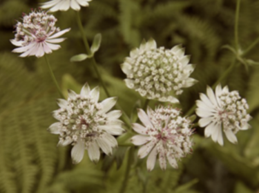
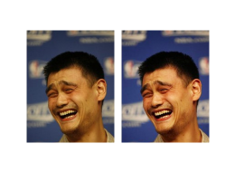

# Core Image 学习笔记

## 滤镜功能

### 基本用法

滤镜功能由 `CIFilter` 提供。使用起来还是比较简单的，根据滤镜名创建对应滤镜，利用 KVC 设置好各项参数，最后生成图片即可。

例如下面这样：

```swift
let ui_inputImage = UIImage(named: "flower")!
// CIFilter 需要的是 CIImage 对象
let ci_inputImage = CIImage(image: ui_inputImage)! 
// 利用 iOS 8.0 的新方法，在创建滤镜时直接设置一些参数，这里直接设置 inputImage 参数
let sepiaFilter = CIFilter(name: "CISepiaTone", withInputParameters: [ kCIInputImageKey : ci_inputImage ])!
// 通过 CIFilter 的 outputImage 属性获取包含滤镜处理信息的 CIImage，并生成 UIImage
imageView.image = UIImage(CIImage: sepiaFilter.outputImage!)
```

效果如图所示：




`CISepiaTone` 滤镜还可以接受一个参数，范围是 `0.0 ~ 1.0`，利用 `kCIInputIntensityKey` 来指定，默认为 `0.5`：

```swift
sepiaFilter.setValue(1.0, forKey: kCIInputIntensityKey)
```

效果如图所示：


`CISepiaTone` 滤镜只有两个参数，非常简单，其他滤镜的使用也是大同小异。

### 改善性能

上述用法最终使用 `UIImage` 的构造方法直接由 `CIImage` 生成最终的图片，虽然简单，但是存在一定性能问题。`CIFilter` 的 `outputImage` 属性返回的 `CIImage` 对象，可以看做对图片进行滤镜处理的各种参数配置，只是个配方，实际的渲染过程则是通过 `CIContext` 来完成的。`UIImage` 的构造方法只是封装了 `CIContext` 的创建以及渲染过程。`CIContext` 的创建代价很昂贵，如果需要对图片进行多次处理，频繁创建 `CIContext` 就会带来严重的性能问题。因此，最好单独创建一个 `CIContext`，重复使用，从而避免额外的性能开销。

另外，使用 `UIImage(CIImage:)` 这种方法创建后，利用 `UIImageView` 显示时，`contentMode` 会被忽略，显示效果可能会不正确。

`CIContext` 的创建方式多种多样，常用的有如下两种：

```swift
/*  基于 CPU 或者 GPU 的上下文，可以通过 kCIContextUseSoftwareRenderer 来使用 CPU 渲染，虽然比 GPU 慢，
    但是支持更大尺寸的输入和输出图片，以及后台渲染。
    即使使用 GPU 渲染，图片也无法直接显示，而是需要拷贝回 CPU 并转换为 UIImage 之类的才可以显示出来。 */
init(options: [String : AnyObject]?)
/*  使用 GPU 渲染，效率很高，不过涉及到一些 OpenGL 知识。。。 */
init(EAGLContext eaglContext: EAGLContext)
```

这里主要介绍下第一种方式：

```swift
// 一般传入 nil 即可
let context = CIContext(options: nil) 
// 生成 CGImage，该过程即是实际的滤镜处理过程，这里指定渲染范围为输入图片的范围
// 另外，有的滤镜的 outputImage 返回的图片是“无限大”的，如果直接创建 UIImage，利用 UIImageView 显示时将引发异常
let cg_outputImage = context.createCGImage(ci_outputImage, fromRect: ci_inputImage.extent)
imageView.image = UIImage(CGImage: cg_outputImage)
```

利用这种方式，再把滤镜处理放到后台，实际效果还是不错的。

### 滤镜效果组合使用

如前所述，`CIFilter` 的 `outputImage` 属性返回的 `CIImage` 只是个滤镜处理的“配方”，并非最终图片。可以将 `outputImage` 作为另一种滤镜的 `inputImage`，然后用最后一种滤镜的 `outputImage` 来渲染最终图片，从而将两种甚至多种滤镜效果进行组合。系统会将各个滤镜“配方”整合为一个优化后的方案（例如需要调整颜色和缩放，调整缩放后的图片的颜色将会更有效率），只进行一次渲染处理，而不是渲染多次，从而提高性能。

```swift
// 将原始图片作为 CISepiaTone 滤镜的输入图片
let sepiaFilter = CIFilter(name: "CISepiaTone", withInputParameters:
    [ kCIInputImageKey : CIImage(image: UIImage(named: "flower")!)! ])!

// 将 CISepiaTone 滤镜的输入图片作为 CISourceAtopCompositing 滤镜的输入图片
let maskFilter = CIFilter(name: "CISourceAtopCompositing", withInputParameters:
    [ kCIInputImageKey : sepiaFilter.outputImage!,
      kCIInputBackgroundImageKey : CIImage(image: UIImage(named: "mask")!)! ])!

// 将 CISourceAtopCompositing 滤镜的输出图片作为 CISourceOverCompositing 滤镜的输入图片
let backgroundFilter = CIFilter(name: "CISourceOverCompositing", withInputParameters:
    [ kCIInputImageKey : maskFilter.outputImage!,
      kCIInputBackgroundImageKey : CIImage(image: UIImage(named: "bryce")!)! ])!

// 利用最后一个滤镜的输出图片进行渲染
let cg_outputImage = context.createCGImage(backgroundFilter.outputImage!, fromRect: ci_inputImage.extent)
imageView.image = UIImage(CGImage: cg_outputImage)
```

效果如下所示：


### 利用滤镜实现过渡动画效果

在 `CICategoryTransition` 滤镜分类下，有一些提供两张图片过渡效果的滤镜。这类滤镜有个 `inputTime` 参数，范围是 `0.0 ~ 1.0`，传入不同的时间点，可以获得过渡过程中相应时间点的图片。因此，可以配合定时器，获取各个时间点的图片并显示出来，从而实现普通动画很难实现的各种过渡动画效果。

### 查询所有滤镜信息

`CIFilter` 提供了两个类方法，可以用来查询内置的滤镜名称：

```swift
/** 返回指定滤镜分类下的所有内置滤镜的名称。 */
class func filterNamesInCategory(category: String?) -> [String]
/** 返回所有指定滤镜分类中共同包含的所有内置滤镜的名称。 */
class func filterNamesInCategories(categories: [String]?) -> [String]
```
    
```swift
// 查询指定分类下的所有滤镜名称，指定 kCICategoryBuiltIn 即可查询所有内置滤镜
CIFilter.filterNamesInCategory(kCICategoryBuiltIn).forEach {
    print($0) // 打印滤镜名称
    print(CIFilter(name: $0)!.attributes) // 根据滤镜名称创建对应滤镜，并通过 attributes 属性查看该滤镜的各项属性
}
```

打印结果如下所示：

```swift
CIAccordionFoldTransition
["inputFoldShadowAmount": {
    CIAttributeClass = NSNumber;
    CIAttributeDefault = "0.1";
    CIAttributeDisplayName = FoldShadowAmount;
    CIAttributeMax = 1;
    CIAttributeMin = 0;
    CIAttributeSliderMax = 1;
    CIAttributeSliderMin = 0;
    CIAttributeType = CIAttributeTypeScalar;
}, "CIAttributeFilterCategories": (
    CICategoryTransition,
    CICategoryVideo,
    CICategoryStillImage,
    CICategoryBuiltIn
), "inputTargetImage": {
    CIAttributeClass = CIImage;
    CIAttributeDescription = "The target image for a transition.";
    CIAttributeDisplayName = "Target Image";
},
...,
"inputTime": {
    CIAttributeClass = NSNumber;
    CIAttributeDefault = 0;
    CIAttributeDescription = "The duration of the effect.";
    CIAttributeDisplayName = Time;
    CIAttributeIdentity = 0;
    CIAttributeMax = 1;
    CIAttributeMin = 0;
    CIAttributeSliderMax = 1;
    CIAttributeSliderMin = 0;
    CIAttributeType = CIAttributeTypeTime;
}]
```

可以看到，这些打印结果包含滤镜的各项信息，甚至包含 `CIAttributeSliderMin` 和 `CIAttributeSliderMax` 这样的值，可以据此构建 UI 界面。

## 其他功能

### 面部识别

```swift
// 创建用于识别人脸的识别器，指定为高精度识别，但这会耗费更多时间
let detector = CIDetector(ofType: CIDetectorTypeFace, context: nil, options: [ CIDetectorAccuracy : CIDetectorAccuracyHigh ])
// 对指定图片进行识别处理，为了不阻塞主线程，最好放到后台处理
let features = detector.featuresInImage(CIImage(image: anImage!)!) as! [CIFaceFeature]
```

iOS 7 还可以识别眨眼和微笑，可以指定 `CIDetectorEyeBlink` 和 `CIDetectorSmile` 这两个键为 `true`，并使用如下识别方法：

```swift
func featuresInImage(image: CIImage, options: [String : AnyObject]?) -> [CIFeature]
```

`CIFaceFeature` 封装了一些识别结果的信息，例如人脸在图片中的区域，眼睛和嘴巴的位置等等。

### 图片效果改善

`CIImage` 提供了一个自动改善图片效果的方法，提供了诸如消除红眼之类的效果：

```swift
func autoAdjustmentFiltersWithOptions(_ options: [String : AnyObject]?) -> [CIFilter]
```

```swift
var outputImage = CIImage(image: imageView.image!)!
// CIImage 的如下方法可以自动分析图片，并返回相应的滤镜数组，将这些滤镜的效果组合起来即可
outputImage.autoAdjustmentFiltersWithOptions(nil).forEach {
    $0.setValue(outputImage, forKey: kCIInputImageKey)
    outputImage = $0.outputImage!
    print($0.attributes[kCIAttributeFilterDisplayName]!)
    /*  打印看看使用了哪些滤镜
    CIFaceBalance
    Vibrance
    Tone Curve
    Highlight and Shadow Adjust */
}

// 实际的处理过程，最好放到后台进行
let cg_outputImage = CIContext(options: nil).createCGImage(outputImage, fromRect: outputImage.extent)
let ui_outputImage = UIImage(CGImage: cg_outputImage, scale: 2.0, orientation: .Up)
imageView.image = ui_outputImage
```

效果如下所示：

