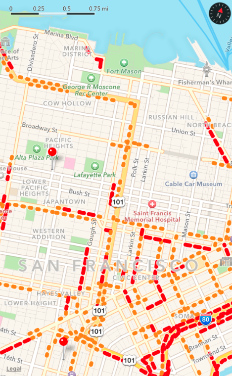
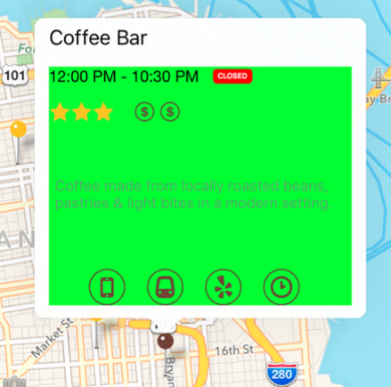
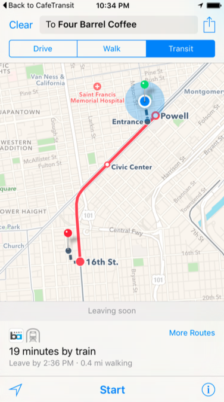

# 地图与位置相关 API 的新特性

学习自 *iOS 9 by Tutorials*，这里记录些笔记。

## 地图外观

关于地图外观，iOS 9 中新增了如下三个属性：

```swift
var showsScale: Bool   // 显示比例尺。
var showsCompass: Bool // 显示指南针。
var showsTraffic: Bool // 显示交通状况，只对 .Standard 和 .Hybrid 类型的地图有效。
```

全部开启后将类似下图这样：



## 大头针颜色

在 iOS 9 之前，大头针，也就是 `MKPinAnnotationView`，只有有限的三种颜色。

从 iOS 9 开始，`pinColor` 属性被弃用，改用 `pinTintColor` 属性替代，从而可以方便地设置各种各样的颜色了：

```swift
@available(iOS 9.0, *)
var pinTintColor: UIColor!

@available(iOS, introduced=3.0, deprecated=9.0, message="Use pinTintColor instead")
var pinColor: MKPinAnnotationColor
```

## 自定义 MKAnnotationView 的辅助视图

在 iOS 9 之前，添加比较复杂的自定义辅助视图还是比较麻烦的。

在 iOS 9，`MKAnnotationView` 新引入了 `detailCalloutAccessoryView` 属性，将其设置为自定义的视图即可。

需要注意的是，自定义视图需实现 `intrinsicContentSize()` 方法，返回适当的固有尺寸，从而指导 `MKAnnotationView` 进行相关的布局。如果自定义视图使用 `Auto Layout`，就不用自己实现此方法了。

下图这种辅助视图（图中绿色部分）即是使用 `xib` 配合 `Auto Layout` 构建的，实例化视图后，直接赋值给 `detailCalloutAccessoryView` 属性即可：




## 时区支持

在 iOS 9，`CLPlacemark` 新增了 `timeZone` 属性，这样在进行地理编码或者反编码时，可以方便地获取对应的时区：

```swift
@available(iOS 9.0, *)
@NSCopying var timeZone: NSTimeZone? { get }
```

## 单次获取位置信息

在 iOS 9，`CLLocationManager` 引入了新方法 `requestLocation()`，可以非常方便地获取位置信息，它使用和连续更新一样的代理方法，在发送完期望精度的位置信息后，会自动将定位功能关闭：

```swift
class ViewController: UIViewController, CLLocationManagerDelegate {
    let locationManager = CLLocationManager()
    
    override func viewDidLoad() {
        super.viewDidLoad()

        locationManager.delegate = self
        locationManager.desiredAccuracy = kCLLocationAccuracyHundredMeters
        locationManager.requestLocation()
    }

   // MARK: - CLLocationManagerDelegate

    func locationManager(manager: CLLocationManager, didUpdateLocations locations: [CLLocation]) {
        if let location = locations.first {
            print("当前位置：\(location)")
        }
    }

    func locationManager(manager: CLLocationManager, didFailWithError error: NSError) {
        print("获取位置失败：\(error.localizedDescription)")
    }
}
```

## 使用官方地图导航

在 iOS 9，`MKMapItem` 新增了 `MKLaunchOptionsDirectionsModeTransit` 常量，可以非常方便地使用官方地图进行导航，使用方式如下：

```swift
let placemark = MKPlacemark(coordinate: aCoordinate, addressDictionary: ["street" : "Four Barrel Coffee"])
let mapItem = MKMapItem(placemark: placemark)
let launchOptions = [MKLaunchOptionsDirectionsModeKey : MKLaunchOptionsDirectionsModeTransit]
mapItem.openInMapsWithLaunchOptions(launchOptions)
```

效果如下图所示：



## 计算出发与到达时间

早在 iOS 7，就可以通过 `MKDirections` 的 `calculateETAWithCompletionHandler(_:)` 方法计算行程时间，该方法异步执行，最后会通过回调闭包传递一个 `MKETAResponse` 对象：

```swift
@available(iOS 7.0, *)
class MKETAResponse : NSObject {
    // Source and destination may be filled with additional details compared to the request object.
    var source: MKMapItem { get }
    var destination: MKMapItem { get }
    var expectedTravelTime: NSTimeInterval { get } // 行程时间
    @available(iOS 9.0, *)
    var distance: CLLocationDistance { get } // 总路程，单位是米
    @available(iOS 9.0, *)
    var expectedArrivalDate: NSDate { get } // 到达时间
    @available(iOS 9.0, *)
    var expectedDepartureDate: NSDate { get } // 出发时间
    @available(iOS 9.0, *)
    var transportType: MKDirectionsTransportType { get }
}
```

可以看到，在 iOS 9，`MKETAResponse` 增加了对“总路程”、“出发时间”、“到达时间”的新支持。

使用方法类似下面这样：

```swift
let request = MKDirectionsRequest()

let source = MKMapItem(placemark: MKPlacemark(coordinate: /* 出发地坐标 */, addressDictionary: nil))
let destination = MKMapItem(placemark: MKPlacemark(coordinate: /* 目的地坐标 */, addressDictionary: nil))

request.source = source
request.destination = destination
request.transportType = .Transit // iOS 9 新增的枚举值

MKDirections(request: request).calculateETAWithCompletionHandler { response, error in
    if let error = error {
        print(error.localizedDescription)
    } else {
        // 在这里做些时间处理工作
    }
}
```
