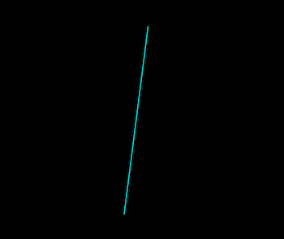

# 利用 CAReplicatorLayer 实现烟花动画

学习自 [iOS Animations by Emails](http://ios-animations-by-emails.com) 11月的教程 [Uberworks](http://ios-animations-by-emails.com/posts/2015-november)。

本期讲解了如何利用 `CAReplicatorLayer` 的复制功能来实现一个烟花效果的动画。关于 `CAReplicatorLayer`，可以看看我整理的之前的一篇教程 [Creating animations with CAReplicatorLayer](https://github.com/949478479/Learning-Notes/tree/Creating-animations-with-CAReplicatorLayer)。

## 准备开始

可以先下载启动项目 [Uberworks-starter.zip](http://www.ios-animations-by-emails.com/assets/2015-november/Uberworks-starter.zip)，其中包含了一个拥有黑色背景的视图控制器以及此次教程中用到的 [EasyAnimation](https://github.com/icanzilb/EasyAnimation) 动画库，利用这个动画库，可以方便地使用 `UIView` 的一些列动画方法来执行图层动画。当然，使用 `CAAnimation` 也是可以的，就是代码繁琐一些。

## 创建烟花的轨迹

首先，创建一个线条图层来模拟烟花的轨迹。添加如下方法：

```swift
func animatedLine(from from: CGPoint, to: CGPoint) -> CAShapeLayer {

    let linePath = UIBezierPath()
    linePath.moveToPoint(from)
    linePath.addLineToPoint(to)
    
    let line = CAShapeLayer()
    line.path = linePath.CGPath
    line.lineCap = kCALineCapRound
    line.strokeColor = UIColor.cyanColor().CGColor
    
    return line
}
```

在 `viewDidAppear(_:)` 方法中添加新创建的图层看看效果如何：

```swift
override func viewDidAppear(animated: Bool) {
    super.viewDidAppear(animated)
    view.layer.addSublayer(animatedLine(from: CGPoint(x: 160, y: 550), to: view.center))
}
```

运行效果大概这样：



接下来，利用动画改变 `CAShapeLayer` 的 `strokeEnd`，让线条逐渐显现：

```swift
func animatedLine(from from: CGPoint, to: CGPoint) -> CAShapeLayer {
    // ...
    
    line.strokeEnd = 0.0
    UIView.animateWithDuration(1.0, delay: 0.0, options: [.CurveEaseOut], animations: {
        line.strokeEnd = 1.0
    }, completion: nil)
    
    return line
}
```

运行效果大概这样：


然后，再改变 `strokeStart`，让线条逐渐消失：

```swift
func animatedLine(from from: CGPoint, to: CGPoint) -> CAShapeLayer {
    // ...
    
    UIView.animateWithDuration(0.75, delay: 0.9, options: [.CurveEaseOut], animations: {
        line.strokeStart = 1.0
    }, completion: nil)
    
    return line
}
```

运行效果大概这样：


## 创建一个爆炸的烟花

首先，创建一个 `CAReplicatorLayer` 图层，添加如下方法：

```swift
func firework1(atPoint atPoint: CGPoint) -> CAReplicatorLayer {
    let replicator = CAReplicatorLayer()
    replicator.position = atPoint
    return replicator
}
```

接着，像之前一样添加一个线条图层上去，模拟烟花爆炸后的一条轨迹：

```swift
func firework1(atPoint atPoint: CGPoint) -> CAReplicatorLayer {
    // ...
    
    let f11linePath = UIBezierPath()
    f11linePath.moveToPoint(CGPoint(x: 0, y: 0))
    f11linePath.addLineToPoint(CGPoint(x: 0, y: -100))

    let f11line = CAShapeLayer()
    f11line.path = f11linePath.CGPath
    f11line.strokeColor = UIColor.cyanColor().CGColor
    replicator.addSublayer(f11line)
    
    return replicator
}
```

回到 `viewDidAppear(_:)` 方法，延迟 1 秒后添加新创建的线条图层看看效果：

```swift
override func viewDidAppear(animated: Bool) {
    super.viewDidAppear(animated)
    
    view.layer.addSublayer(animatedLine(from: CGPoint(x: 160, y: 550), to: view.center))

    delay(seconds: 1.0) {
        self.view.layer.addSublayer(self.firework1(atPoint: self.view.center))
    }
}
```

运行效果大概这样：


接下来，开始使用 `CAReplicatorLayer` 的复制能力，回到 `firework1(atPoint:)` 方法，添加如下代码：

```swift
replicator.instanceCount = 20
replicator.instanceTransform = CATransform3DMakeRotation(CGFloat(M_PI/10), 0, 0, 1)
```

`CAReplicatorLayer` 会将子图层，也就是前面添加的线条图层复制成 20 份，每个相对前一个偏移一定角度，为了均匀排布一周，将角度设置为 `M_PI/10`。

运行效果大概这样：


接着，利用动画改变线条图层的 `strokeEnd`，让线条逐渐显现。回到 `firework1(atPoint:)` 方法，添加如下代码：

```swift
f11line.strokeEnd = 0
UIView.animateWithDuration(1.0, delay: 0.33, options: [.CurveEaseOut], animations: {
    f11line.strokeEnd = 1.0
}, completion: nil)
```

运行效果大概这样：


接下来，添加烟花爆炸的第二个阶段的动画。依旧在 `firework1(atPoint:)` 方法中，添加如下代码，创建虚线线条图层并进行动画：

```swift
let f12linePath = UIBezierPath()
f12linePath.moveToPoint(CGPoint(x: 0, y: -0))
f12linePath.addLineToPoint(CGPoint(x: 0, y: -100))
f12linePath.applyTransform(CGAffineTransformMakeRotation(CGFloat(M_PI/20)))

let f12line = CAShapeLayer()
f12line.path = f12linePath.CGPath
f12line.lineDashPattern = [20, 2]
f12line.strokeColor = UIColor.cyanColor().CGColor
replicator.addSublayer(f12line)

f12line.strokeEnd = 0
UIView.animateWithDuration(1.0, delay: 0.0, options: [.CurveEaseOut], animations: {
    f12line.strokeEnd = 1.0
}, completion: nil)
```

基本上和之前创建线条图层一样，只不过变成了虚线，`[20, 2]` 表示“先绘制长为 20 点的一段实线，然后空 2 点，之后一直重复前面的过程”。另外，这里将虚线的初始角度旋转了 `M_PI/20`，这样实线和虚线就能交错排开了。

运行效果大概这样：


看起来不错，接着利用动画修改 `strokeStart` 来让这些线条逐渐消失，以此模拟烟花爆炸轨迹的消失。还是在 `firework1(atPoint:)` 方法中，添加以下代码：

```swift
UIView.animateWithDuration(1.0, delay: 1.0, options: [.CurveEaseIn], animations: {
    f11line.strokeStart = 1.0
    f12line.strokeStart = 0.5
}, completion: nil)
```

`f12line.strokeStart = 0.5` 意味着虚线只会消失一半，这样效果看起来更好一些。

运行效果大概这样：


最后，为这些线条添加旋转以及淡出动画，让烟花消失的效果更加自然：

```swift
f11line.transform = CATransform3DMakeRotation(CGFloat(M_PI_4), 0, 0, 1)
f12line.transform = CATransform3DMakeRotation(CGFloat(M_PI_4/2), 0, 0, 1)
replicator.opacity = 0.0
```

最后的效果大概这样：


## 创建另一种爆炸的烟花

接下来，为了丰富内容，来创建另一种效果的烟花。添加下面的方法，创建一个青色的点：

```swift
func animatedDot(delta delta: CGFloat, delay: Double) -> CALayer {
    let dot = CALayer()
    dot.frame = CGRect(x: 0, y: 0, width: 1, height: 1)
    dot.backgroundColor = UIColor.cyanColor().CGColor
    return dot
}
```

然后，添加下面的方法，像之前一样，创建 `CAReplicatorLayer` 图层：

```swift
func firework2(atPoint atPoint: CGPoint) -> CAReplicatorLayer {
    let replicator = CAReplicatorLayer()
    replicator.position = atPoint
    replicator.instanceCount = 40
    replicator.instanceTransform = CATransform3DMakeRotation(CGFloat(M_PI/20), 0, 0, 1)
    return replicator
}
```

这一次，复制了 40 份，均匀排成一个圈。接下来添加先前创建的点上去看看效果：

```swift
func firework2(atPoint atPoint: CGPoint) -> CAReplicatorLayer {
    // ...
    replicator.addSublayer(animatedDot(delta: 0, delay: 0))
    return replicator
}
```

创建点图层时，由于 `dot.frame = CGRect(x: 0, y: 0, width: 1, height: 1)`，所有的点都是挤在中心的，可以将 `y` 改为 `10` 之类的，方便查看效果。

在 `viewDidAppear(_:)` 方法中调用下看看效果：

```swift
delay(seconds: 1.0) {
    self.view.layer.addSublayer(self.firework2(atPoint: self.view.center))
}
```

运行效果大概这样：


可以看到所有点排成了一圈，现在可以将 `y` 坐标改回去了，在 `animatedDot(delta:delay:)` 方法中添加以下代码，利用动画修改点图层的 `y` 坐标，让所有点散开：

```swift
UIView.animateAndChainWithDuration(1.0, delay: delay, options: [.CurveEaseOut], animations: {
    dot.transform = CATransform3DMakeTranslation(0, -delta, 0)
}, completion: nil)
```

然后回到 `firework2(atPoint:)` 方法，将 `replicator.addSublayer(animatedDot(delta: 0, delay: 0))` 的第一个参数 `delta` 替换为 `50`，从而让所有点散开。

运行效果大概这样：


接着，来到 `animatedDot(delta:delay:)` 方法中，进一步完善点图层的动画，在散开之后进行旋转，旋转之后进一步扩散并逐渐消失：

```swift
UIView.animateAndChainWithDuration(1.0, delay: delay, options: [.CurveEaseOut], animations: {
    dot.transform = CATransform3DMakeTranslation(0, -delta, 0)
}, completion: nil).animateWithDuration(2.0, animations: {
    dot.transform = CATransform3DConcat(dot.transform, CATransform3DMakeRotation(CGFloat(M_PI_4), 0, 0, 1))
}).animateWithDuration(1.0, animations: {
    dot.transform = CATransform3DConcat(dot.transform, CATransform3DMakeTranslation(0, -delta, 0))
    dot.opacity = 0.1
})
```

运行效果大概这样：


最后，来到 `firework2(atPoint:)` 方法，找到以下代码：

```swift
replicator.addSublayer(animatedDot(delta: 50, delay: 0))
```

将其替换为如下代码：

```swift
for i in 1...10 {
    replicator.addSublayer(animatedDot(delta: CGFloat(i*10), delay: 1/Double(i)))
}
```

利用循环添加 10 次，每次设置不同的扩散偏移量和延迟，呈现多层嵌套的效果。

最后的效果大概这样：


