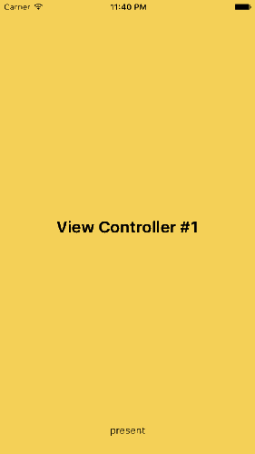

# CurveRefreshControl



灵感来自这篇博客 [iOS 自定义下拉线条动画](http://kittenyang.com/curvelineanimation/)，图文并茂，就是公式看着头疼- -，我按照自己的方式重新实现了下。。。

## 动画处理

原作者的实现方案是在 `CALayer` 的 `drawInContext(_:)` 方法中根据相应进度绘制图案，在下拉过程中反复调用 `setNeedsDisplay()` 来重绘。

我的实现方案是利用 `CAShapeLayer` 先画好图案，添加到视图上，如下图所示：


图中蓝色的线条和箭头总共由四个 `CAShapeLayer` 组成，线条和小箭头各用两个。线条的路径是一段直线加半个圆弧，小箭头的路径就是个小斜线。

对于线条图层，改变其 `strokeStart` 和 `strokeEnd`，这样就会呈现一段直线变成圆弧的效果。对于小箭头图层，在线条的直线阶段，改变其 `position.y`，使之和线条一起沿直线运动；在线条变为圆弧的阶段，改变其 `transform.rotate.z`，使之一同旋转。另外，为了方便小箭头旋转，对其锚点进行相应修改，小箭头在图中位置时，其锚点位于视图中心点，就能绕着视图中心点旋转了。

在下拉过程中，可以根据相应百分比来修改这些图层属性，从而呈现动画效果。但此方法在线条进入圆弧时，小箭头和线条难以无缝同步，特别是拖动速度很快时。因此最后还是改用图层动画来实现，首先需要将这四个小图层的 `speed` 属性设置为 `0`，这将导致图层动画默认是静止的，然后在下拉过程中，根据进度修改这些图层的 `timeOffset`，从而实现手动动画。同样，为了方便，将动画的 `duration` 设置为 `1.0`，这样就能和下拉进度相匹配了。在这种情况下，使用图层动画不仅解决了同步问题，还避免了很多计算，只需设置初始和结束的状态，剩下的交给核心动画即可。

通过这种方法能实现一些巧妙的效果，例如这两篇博客：

[Controlling Animation Timing](http://ronnqvi.st/controlling-animation-timing/)  
[Animating the Drawing of a CGPath With CAShapeLayer](http://oleb.net/blog/2010/12/animating-drawing-of-cgpath-with-cashapelayer/)  

线条的动画代码如下：

```swift
/*  线条的绘制路径是从圆弧开始，一直绘制到直线末端。
    由 1.0 过渡到 0.0 的效果即为线条从直线末端开始，绘制到圆弧的起点。 */
let strokeStartAnimatetion = CABasicAnimation(keyPath: "strokeStart")
strokeStartAnimatetion.fromValue = 1.0
strokeStartAnimatetion.toValue = 0.0

/*  strokeEnd 最终变为 0.45，由于线条的直线部分和圆弧部分一样长，因此各占 0.5，
    而 0.45 则意味着最终的圆弧会少一小段，这主要是为了防止两条线条首尾相连。 */
let strokeEndAnimatetion = CABasicAnimation(keyPath: "strokeEnd")
strokeEndAnimatetion.fromValue = 1.45
strokeEndAnimatetion.toValue = 0.45

/*  使用时长为 1.0 的动画组结合两个动画，如前所述，1.0 是为了和总进度的 1.0 相匹配。 */
let animationGroup = CAAnimationGroup()
animationGroup.duration = 1.0
animationGroup.animations = [strokeStartAnimatetion, strokeEndAnimatetion]
```

小箭头的动画略微不同，分为两个阶段，而且左右两个小箭头需分别考虑：

```swift
/*  在动画的前半段，小箭头和线条一起直线运动，左侧小箭头由视图底边界运动到水平中心。 */
let positionAnimatetion = CABasicAnimation(keyPath: "position.y")
positionAnimatetion.duration = 0.5
positionAnimatetion.fromValue = bounds.height
positionAnimatetion.toValue = bounds.midY

/*  在动画的后半段，小箭头开始进入旋转半个圆弧的过程。 */
let transformAnimatetion = CABasicAnimation(keyPath: "transform.rotation.z")
transformAnimatetion.duration = 0.5
transformAnimatetion.beginTime = 0.5
transformAnimatetion.byValue = CGFloat(M_PI)

/*  同样，使用动画组结合两段动画。 */
let animationGroup = CAAnimationGroup()
animationGroup.duration = 1.0
animationGroup.animations = [positionAnimatetion.copy() as! CABasicAnimation, transformAnimatetion]

/*  右侧小箭头的前半段动画由视图的顶部边界运动到水平中心。 */
positionAnimatetion.fromValue = 0
positionAnimatetion.toValue = bounds.midY
animationGroup.animations = [positionAnimatetion, transformAnimatetion]
```

交互过程的动画处理就这么多，可以将这些动画对象保留起来，在拖拽时添加到图层上，然后在结束后将其从图层上移除。

至于旋转动画，直接对视图的 `layer` 也就是四个小图层的父图层做无限旋转动画即可：

```swift
let refreshingAnimation = CABasicAnimation(keyPath: "transform.rotation.z")
refreshingAnimation.byValue = M_PI * 2
refreshingAnimation.duration = 1.0
refreshingAnimation.repeatCount = Float.infinity
```

## 刷新处理

### UIRefreshControl 的限制

最简单的方案应该是继承 `UIRefreshControl`，将自定义的刷新控件添加为子视图。不过这样会受到很多限制，只能用于 `UITableView`，而且无法修改下拉幅度。通过打印内部结构，其下拉幅度是 `132.0`，尝试修改但是又被系统改回去了。还有个问题就是只要达到下拉幅度，还没松手就会触发刷新方法，感觉很不好。

放弃这种方案的话，可以将自定义的刷新控件添加到 `UIScrollView` 的顶部边界之外，也就是刷新控件的底部紧贴 `UIScrollView` 的顶部，将其隐藏，向下拖动时再显示，刷新控件就会随着拖动露出来。

为了监听下拉进度，需要通过 KVO 监听 `UIScrollView` 的 `contentOffset`，然后做出相应处理。

### contentInset.top 与 contentOffset.y

`UIScrollView` 往往会处于具有导航栏的环境下，视图控制器的 `automaticallyAdjustsScrollViewInsets` 属性默认是开启的，这将导致 `UIScrollView` 的 `contentInset.top` 被改为 `64.0`（iPhone 横屏下则是 `32.0`）。因此，`UIScrollView` 的 `contentOffset.y` 一开始即为 `-64.0`，所以处理 `contentOffset` 的变化时，需要将其考虑进去。

另外，当拖拽幅度满足触发刷新的幅度时，可以将 `UIScrollView` 的 `contentInset.top` 增加额外的高度，例如刷新控件的高度，从而可以在松手后也能显示刷新控件。相反，结束刷新后则恢复原有的值，从而让刷新控件回到 `UIScrollView` 顶部。

### tracking、decelerating 与 dragging

处理拖拽时，有两个属性非常好用：`tracking` 和 `decelerating`。`tracking` 属性可以用来判断用户是否在拖拽，若是则为 `true`。而 `decelerating` 属性可以判断 `UIScrollView` 在用户松手后是否是静止的，无论是拖拽后松手由于惯性而运动，还是拖拽触发弹簧效果后松手，此属性均为 `true`。至于 `dragging` 属性，实在是名不副实，它主要反映了 `UIScrollView` 是否在滚动，而并非是否处于拖拽中。滚动包括设置 `contentOffset` 而造成的滚动，但是貌似不包括拖拽触发弹簧效果后再松手时的滚动，感觉这个属性远不如上面两个好用- -。

### 自动刷新时的动画处理

除了手动拖拽来触发刷新，还应该可以通过编程的方式触发刷新。这时候该如何处理原先依靠拖拽进度来控制的动画？个人的解决方案是通过 `UIScrollView` 的 `setContentOffset(_:animated:)` 方法来模拟手动拖拽，只要开启动画，就会造成 `contentOffset` 多次改变，和手动拖拽时很像。然后，可以监听进度，只要达到 `1.0`，就增加 `contentInset.top`，并启动刷新动画。结束刷新时同样用此方法将 `contentOffset.top` 还原，然后在进度为 `0.0` 时还原 `contentInset.top` 即可。

