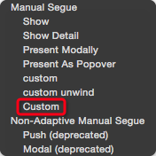
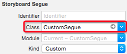

# 使用自定义 Segue 实现转场动画


想要自定义 Segue，首先继承 `UIStoryboardSegue`，然后实现 `perform()` 方法。

然后在建立 Segue 时弹出的选项中，选择 Custom 选项，如下图所示：



最后选中这个 Segue，将其所属类设置为自定义 Segue 的类，如下图所示：



使用 Unwind Segue 时，选中 Unwind Segue，修改对应的类即可

## 方案一

直接在 `perform()` 方法中设计一些自定义的过渡动画，如下所示：

```swift
class CustomSegue: UIStoryboardSegue {
    override func perform() {
        let sourceView = sourceViewController.view
        let destinationView = destinationViewController.view

        // 将目标控制器的视图添加到窗口上，从而实现一些动画效果
        let window = UIApplication.sharedApplication().keyWindow!
        window.addSubview(destinationView)

        let minScaleTransform = CGAffineTransformMakeScale(0.001, 0.001)
        destinationView.transform = minScaleTransform
        
        UIView.animateWithDuration(0.4, animations: {
            sourceView.transform = minScaleTransform
        }, completion: { _ in
            UIView.animateWithDuration(0.4, animations: {
                destinationView.transform = CGAffineTransformIdentity
            }, completion: { _ in
                // 完成实际的 present 过程
                self.sourceViewController.presentViewController(self.destinationViewController, 
                    animated: false, completion: nil)
                self.sourceViewController.view.transform = CGAffineTransformIdentity
            })
        })
    }
}
```

## 方案二

在 `perform()` 方法中设置目标控制器的过渡代理，为其提供自定义的过渡动画：

```swift
class CustomSegue: UIStoryboardSegue {
    override func perform() {
    	// 作为目标控制器的过渡代理
        destinationViewController.transitioningDelegate = self
        super.perform()
    }
}

extension CustomSegue: UIViewControllerTransitioningDelegate {

    func animationControllerForPresentedController(presented: UIViewController,
        presentingController presenting: UIViewController,
        sourceController source: UIViewController) -> UIViewControllerAnimatedTransitioning? {
        return PresentAnimator() // 提供自定义的 present 过渡动画对象
    }
    
    func animationControllerForDismissedController(dismissed: UIViewController)
        -> UIViewControllerAnimatedTransitioning? {
        return DismissAnimator() // 提供自定义的 dismiss 过渡动画对象
    }
}

class PresentAnimator: NSObject, UIViewControllerAnimatedTransitioning {
    // ...
}

class DismissAnimator: NSObject, UIViewControllerAnimatedTransitioning {
    // ...
}
```

> 注意  
> 和方案一不同，在 IB 中需要设置 Segue 的类型为代理方法的对应类型，当前例子中即是 Present Modally 类型。另外，使用 Unwind Segue 时，不要设置 Unwind Segue 的类，也就是由同一个 Segue 提供两个动画过程的动画对象。