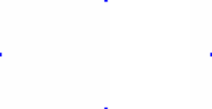
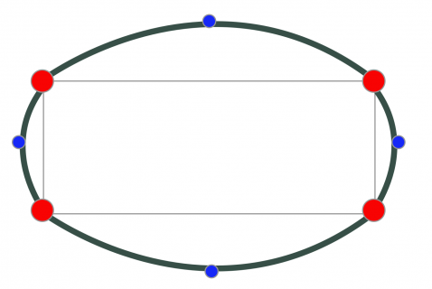

# 如何创建一个弹性动画


学习自 `RayWenderlich` 出品的教程 [How To Create an Elastic Animation with Swift](http://www.raywenderlich.com/100939/how-to-create-an-elastic-animation-with-swift) 。

中文传送门 [如何用Swift实现一个好玩的弹性动画](http://www.cocoachina.com/swift/20150911/13215.html) 。

## 思路

创建一个容器视图，然后向上面添加四个子视图，作为四个控制点。如下图所示，图中白色部分即容器视图，四个蓝色的小点即是作为控制点的四个子视图：




然后向容器视图上添加一个等大小的 `CAShapeLayer`，设置其背景色和容器视图相同。

最后利用 `UIView` 的弹性动画方法调整四个子视图的中心点。在动画过程中，配合 `CADisplayLink` 定时器，获取这些子视图在动画中的实时中心点，以此作为贝塞尔曲线的控制点，实时改变 `CAShapeLayer` 的 `path` 属性。如下图所示：



四个控制点视图的动画方法如下：

```swift
UIView.animateWithDuration(0.25, delay: 0, usingSpringWithDamping: 0.9,
    initialSpringVelocity: 0, options: [], animations: {
    	// 改变四个控制点视图的中心点，也就等于改变了贝塞尔曲线的控制点
        self.topControlPointView.center.y    -= 10
        self.leftControlPointView.center.x   -= 10
        self.bottomControlPointView.center.y += 10
        self.rightControlPointView.center.x  += 10
    }, completion: { _ in
    	// 扩张动画结束后，执行恢复动画
        UIView.animateWithDuration(0.45, delay: 0, usingSpringWithDamping: 0.15,
            initialSpringVelocity: 0, options: [], animations: {
                self.positionControlPoints() // 将四个控制点视图恢复正常位置
            }, completion: { _ in
                self.displayLink.paused = true // 动画完全结束，暂停定时器
        })
})

displayLink.paused = false // 动画开始后启动定时器
```

在动画过程中，通过定时器以屏幕刷新的频率反复获取四个控制点视图的中心点的实时位置：

```swift
// 获取四个控制点视图的中心点的实时位置
let top = topControlPointView.layer.presentationLayer()!.position
let left = leftControlPointView.layer.presentationLayer()!.position
let bottom = bottomControlPointView.layer.presentationLayer()!.position
let right = rightControlPointView.layer.presentationLayer()!.position

let width = frame.width
let height = frame.height

// 根据四个控制点的实时位置创建 CGPath
let path = CGPathCreateMutable()
CGPathMoveToPoint(path, nil, 0, 0)
CGPathAddQuadCurveToPoint(path, nil, top.x, top.y, width, 0)
CGPathAddQuadCurveToPoint(path, nil, right.x, right.y, width, height)
CGPathAddQuadCurveToPoint(path, nil, bottom.x, bottom.y, 0, height)
CGPathAddQuadCurveToPoint(path, nil, left.x, left.y, 0, 0)

// 更新 CAShapeLayer 的 path，由于频率很高，从而也会呈现弹性动画效果
elasticShapeLayer.path = path
```

最后，将这个容器视图添加到 `UITextField` 上，使二者重合，设置相同的背景色，然后在输入框激活时执行一下动画即可。

## 其他

这种思路还是比较巧妙的，利用现有的 `UIView` 弹性动画，省去了复杂的实时计算。当然，更复杂的弹性效果还是需要手动计算路径，可以参考这篇博客 [谈谈iOS中粘性动画以及果冻效果的实现](http://kittenyang.com/deformationandgooey/) 。
