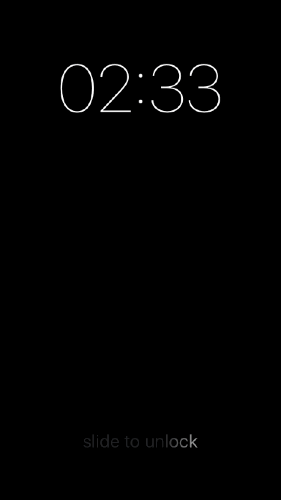
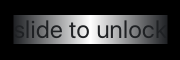
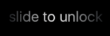

# 利用 CAGradientLayer 配合 mask 实现滑动解锁效果



利用 `CALayer` 的 `mask` 属性，可以实现很多特殊效果，例如这种类似滑动解锁的效果。

在这种情况下，使用一个 `UILabel` 的 `layer` 来充当 `mask`。对于 `UILabel` 来说，其 `layer` 不透明的部分就是上面的文字部分了。当然，使用 `CATextLayer` 似乎更直截了当，但是 `UILabel` 用起来更方便些。

`mask` 所属的图层是一个 `CAGradientLayer`，这里用一个 `UIView` 来提供：

```swift
override class func layerClass() -> AnyClass {
	return CAGradientLayer.self
}
```

接着配置下 `CAGradientLayer`：

```swift
override func awakeFromNib() {
    super.awakeFromNib()

    let gradientLayer = layer as! CAGradientLayer

    gradientLayer.startPoint = CGPoint(x: 0, y: 0.5)
    gradientLayer.endPoint = CGPoint(x: 1, y: 0.5)
    gradientLayer.locations = [ 0, 0.5, 1 ]
    gradientLayer.colors = [
        label.textColor.CGColor,
        UIColor.whiteColor().CGColor,
        label.textColor.CGColor
    ]

    layer.mask = label.layer
}
```

为了省事，这里直接将 `UILabel` 作为了背景视图的子视图，这样方便根据文字决定背景视图尺寸。然后将 `UILabel` 的 `layer` 设置为了背景视图图层的 `mask`。根据文档说明，作为 `mask` 的图层如果有父图层，其行为是不确定的。然而，这里的 `UILabel` 不仅有父视图，而且还将自身的图层作为了父视图图层的 `mask`，基本上各种胡来，不过从实际效果来看一切还算正常。

`CAGradientLayer` 未设置 `mask` 时如下图所示：



将 `UILabel` 的 `layer` 设置为它的 `mask` 后，效果如下所示：



最后利用动画改变 `CAGradientLayer` 的 `locations` 即可：

```swift
let locationsAnimation = CABasicAnimation(keyPath: "locations")
locationsAnimation.fromValue = [ -1, -0.5, 0 ]
locationsAnimation.toValue = [ 1, 1.5, 2 ]
locationsAnimation.duration = 3
locationsAnimation.repeatCount = Float.infinity
layer.addAnimation(locationsAnimation, forKey: nil)
```