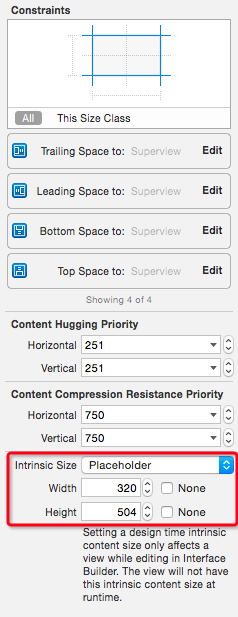

# 简单使用 UIScrollView 的缩放功能

使用 IB 构建 `UIScrollView` 时，`UIScrollView` 会根据自身和子视图之间的约束确定 `contentSize`，水平方向的约束确定 `width`，垂直方向的约束确定 `height`。如果直接在 IB 中将 `UIImageView` 添加到 `UIScrollView` 上，直接将四边约束设置为 `0`，然后为 `UIImageView` 设置个占位的固有尺寸，从而解决无法确定 `UIImageView` 大小的约束歧义报错。当然，如果可以直接设置好图片就更省事了。



想要进行缩放，需实现如下代理方法，返回对应的视图：

```swift
func viewForZoomingInScrollView(scrollView: UIScrollView) -> UIView? {
    return imageView
}
```

缩放主要涉及到 `minimumZoomScale`，`maximumZoomScale`，`zoomScale` 这三个属性，默认都是 `1.0`，前两个属性限制了缩放比率 `zoomScale` 的范围，而 `zoomScale` 决定了当前缩放比率，该值还会影响 `contentSize`。缩放的原理就是将 `zoomScale` 设置为代理方法 `viewForZoomingInScrollView(_:)` 返回的视图的 `transfrom.scale`。

```swift
func configureScrollViewZoomScale() {

    // 由于使用的 IB，确保 imageView 尺寸更新为有效值
    imageView.sizeToFit()
    // 一般在设置 zoomScale 前，最好重置一下，否则被缩放的视图的 transfrom 可能并非初始值，
    // 那么此时获取被缩放视图的 frame 以及滚动视图的 contentSize 会不准确
    scrollView.zoomScale = 1.0

    // 按照 fit 的模式，即宽高不超过屏幕尺寸，且宽或者高等于屏幕宽或者高，确定最小缩放比率
    let scrollViewFrame = scrollView.frame
    let scrollViewContentSize = scrollView.contentSize
    let scaleWidth = scrollViewFrame.width / scrollViewContentSize.width
    let scaleHeight = scrollViewFrame.height / scrollViewContentSize.height
    let minScale = min(scaleWidth, scaleHeight)

    scrollView.minimumZoomScale = minScale
    // 设置 zoomScale 会触发缩放过程，前提是和上次的值不同
    scrollView.zoomScale = minScale
}
```

缩放之后，会触发代理方法 `scrollViewDidZoom(_:)`，一般可以在这里调整 `contentInset`，从而保证被缩放的视图能一直居中：

```swift
func scrollViewDidZoom(scrollView: UIScrollView) {

    let imageViewSize = imageView.frame.size
    let scrollViewSize = scrollView.frame.size

    // 一旦滚动视图的尺寸比被缩放的视图大了，就将多出的这部分用 contentInset 来抵消掉，让视图一直能居中
    // 如果嵌入了导航控制器，注意将视图控制器的 automaticallyAdjustsScrollViewInsets 关闭，手动调整，
    // 否则这里处理 contentInset.top 时需要加上对应值
    let verticalPadding = max((scrollViewSize.height - imageViewSize.height) / 2, 0)
    let horizontalPadding = max((scrollViewSize.width - imageViewSize.width) / 2, 0)

    let contentInset = UIEdgeInsets(top: verticalPadding, left: horizontalPadding,
        bottom: verticalPadding, right: horizontalPadding)

    scrollView.contentInset = contentInset
}
```

一般还会涉及到点击图片放大的功能，可以利用 `zoomToRect(_:animated:)` 方法实现：

```swift
func handleDoubleTap(sender: UITapGestureRecognizer) {
    // 这样就可以以点击点为中心放大了
    let point = sender.locationInView(sender.view)
    let rect = CGRect(x: point.x, y: point.y, width: 1, height: 1)
    scrollView.zoomToRect(rect, animated: true)
}
```
